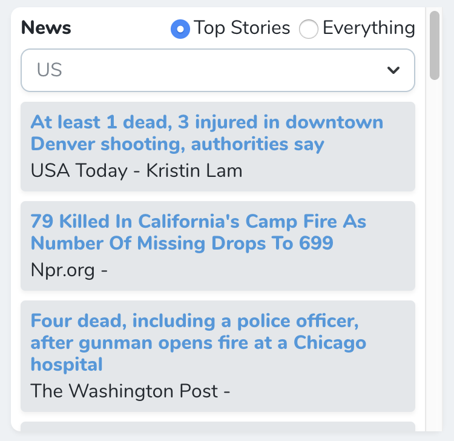

# A Nova card to give you news information
Redis based storage, and powered by [darksky.net](https://darksky.net)

All you will need is a developer token from darksky, and predis for key persistence.


[](https://packagist.org/packages/kregel/kregel/nova-news-card)
[](https://packagist.org/packages/kregel/kregel/nova-news-card)



## Installation

You can install the package in to a Laravel app that uses [Nova](https://nova.laravel.com) via composer:

```bash
composer require predis/predis
```
```bash
composer require kregel/nova-news-card
```

Next up, you must register the tool with Nova. This is typically done in the `cards` method of the `NovaServiceProvider`.

## Usage

```php
// in app/Providers/NovaServiceProvider.php

// ...

public function cards()
{
    return [
        // ...
        (new \Kregel\NovaNewsCard\News)->withMeta([
            'from' => \Carbon\Carbon::now()->subDays(5),f
        ]),
        // If you don't define coordinates it will default to your location.
        (new \Kregel\NovaNewsCard\News)->withMeta([
            'name' => 'Current location',
        ]),
        // Or you could forego all configuration. (which will default to no title, and your current location)
        new \Kregel\NovaNewsCard\News,
    ];
}
```

## Contributing

Please see [CONTRIBUTING](CONTRIBUTING.md) for details.

### Security

If you discover any security related issues, please email github@austinkregel.com instead of using the issue tracker.

## Credits

- [Austin kregel](https://github.com/austinkregel)

## License

The MIT License (MIT). Please see [License File](LICENSE.md) for more information.

## Support on Beerpay
Hey dude! Help me out for a couple of :beers:!

[](https://beerpay.io/austinkregel/nova-news-card)  [](https://beerpay.io/austinkregel/nova-news-card?focus=wish)